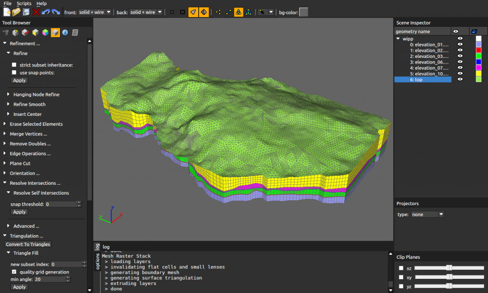
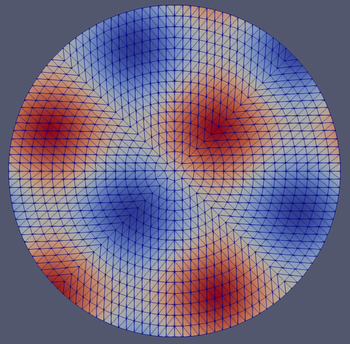
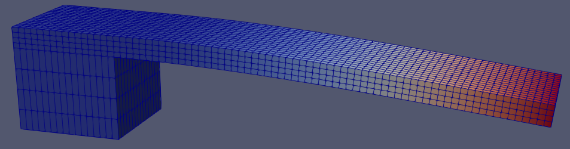
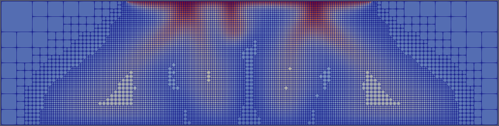
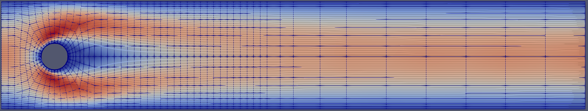
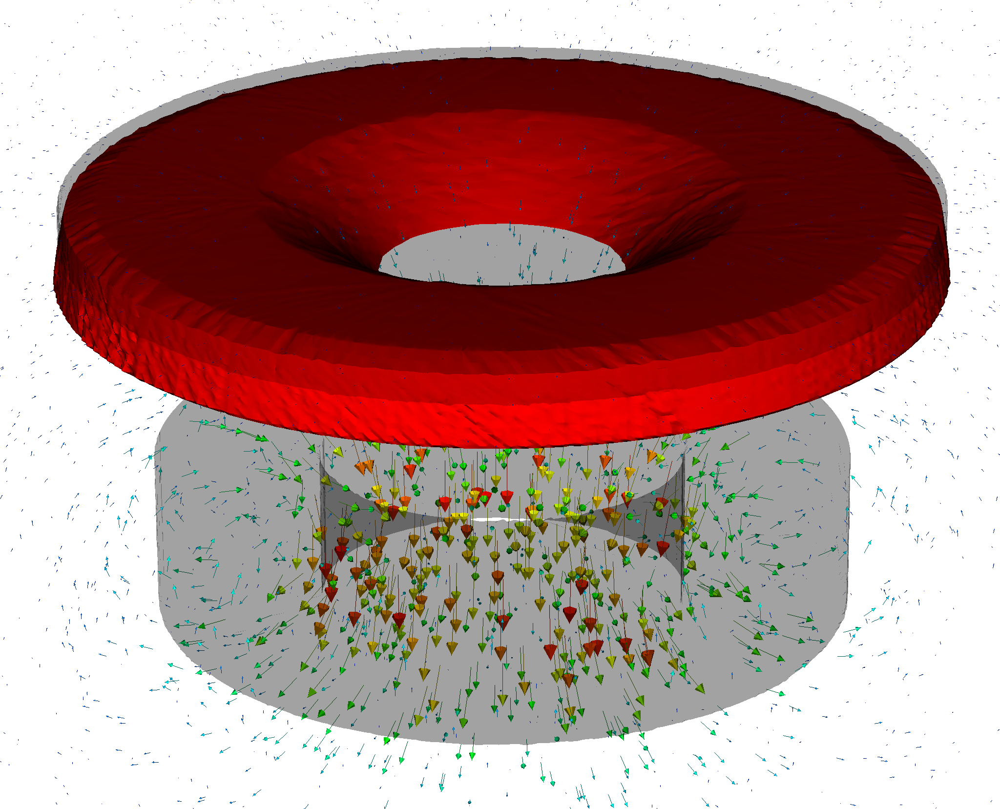
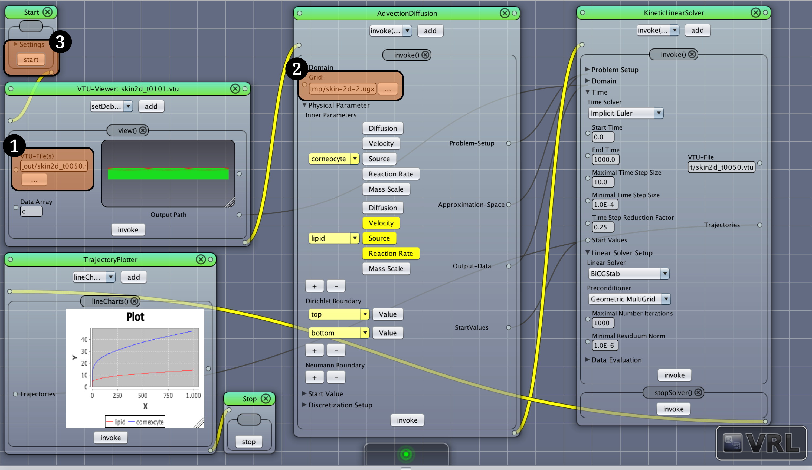

# ugcore
[](https://github.com/UG4/ugcore/actions/workflows/jenkins-trigger.yml)
[](https://sonarcloud.io/summary/new_code?id=UG4_ugcore)
[](https://codeclimate.com/github/UG4/ugcore)
[](https://codeclimate.com/github/UG4/ugcore)
[](https://pypi.org/project/ug4py-base/)

This repository contains the core functionality of **UG4**. Includes sources, build-scripts and utility-scripts

Copyright 2009-2023 Goethe Center for Scientific Computing, Goethe-University Frankfurt am Main

Please install/clone this repository through *UG4's* package manager
[*ughub*](https://github.com/UG4/ughub).

#

# Introduction to UG4

*UG4* is an extensive, flexible, cross-platform open source simulation framework for the numerical solution of systems of partial differential equations. Using *Finite Element* and *Finite Volume* methods on hybrid, adaptive, unstructured multigrid hierarchies, *UG4* allows for the simulation of complex real world models (physical, biological etc.) on massively parallel computer architectures.

*UG4* is implemented in the *C++* programming language and provides grid management, discretization and (linear as well as non-linear) solver utilities. It is extensible and customizable via its plugin mechanism. The highly scalable *MPI* based parallelization of *UG4* has been shown to scale to hundred thousands of cores.

Simulation workflows are defined either using the *Lua* scripting language or the graphical VRL interface [https://vrl-studio.mihosoft.eu/](https://vrl-studio.mihosoft.eu/). Besides that, UG4 can be used as a library for third-party code.

Several examples are provided in the *Examples* application that can be used for simulations of the corresponding phenomena but also serve as demonstration modules for implementing user-defined plugins and scripts. By developing custom plugins, users can extend the functionality of the framework for their particular purposes. The framework provides coupling facilities for the models implemented in different plugins.

The source code is commented using the Doxygen markup language.

*UG4* is licensed under the *LGPL v3* license with amendments. Please have a look at the accompanying *LICENSE* file.

## Preparation of Data and Visualization of Results

The `.ugx` grids provided in the *Examples* applications can be created, visualized, and edited with *ProMesh*, a versatile graphical meshing solution for the generation, visualization, and preparation of computational domains for scientific computing on structured and unstructured grids. It allows users to process complicated geometries with curved boundaries and low-dimensional manifolds. *ProMesh* is based on *UG4's* grid manager and is available at http://www.promesh3d.com



The computational domain, the underlying grid, the boundary and initial conditions, as well as the problem coefficients can be specified as part of the simulation workflow in *Lua* scripts or the *VRL-Studio* GUI. However, for performance reasons, if the evaluation of the spatial and time dependence of the certain parameters is numerically expensive, one can implement those in C+\+, too, e.g. in a custom plugin.

Intermediate and final results of a simulation can be written to *VTK's* `.vtu` file format. These can be visualized using a number of free and open-source toolkits, e.g. *ParaView* [http://www.paraview.org](http://www.paraview.org) and *VisIt* [https://wci.llnl.gov/simulation/computer-codes/visit/](https://wci.llnl.gov/simulation/computer-codes/visit/).

## Setup and Compilation:

For the following guide, we assume the compilation is performed on a Linux/Unix machine using a standard Bash terminal. Please note that Microsoft Windows features such an environment through the free 'Ubuntu' app in the Microsoft Windows Store. If a native Windows executable is required, Visual Studio compilers can also be used.

**Requirements:**

- C++ Compiler (tested with GCC on Linux, Clang on macOS and MSVC 2017 on Windows)
- CMake >= 2.8
- ughub (https://github.com/UG4/ughub)
- git
- python

For a detailed list on required software and corresponding installation instructions, please visit https://github.com/UG4/ughub

Please start by creating a *UG4* root directory, e.g. `$HOME/ug4`. In your `ug4` directory please run the following commands to obtain all required sources:

    ughub init
    ughub install Examples

This will clone *ugcore*, the *Examples* app and all required plugins.

Starting from *UG4's* root directory, please execute the following to build *UG4*:

    mkdir build
    cd build
    cmake -DENABLE_ALL_PLUGINS=ON -DDIM="2;3" -DCPU="1;2" -DCMAKE_BUILD_TYPE=Release ..
    make -j
    cd ..


## Running Examples:
Starting from *UG4's* root directory, please execute the following:

    source ugcore/scripts/shell/ugbash
    mkdir runs
    cd runs
    ugshell -ex Examples/poisson.lua
    ugshell -ex Examples/poisson.lua -dim 3
    ugshell -ex Examples/solmech.lua
    ugshell -ex Examples/elder_adapt.lua
    ugshell -ex Examples/navier_stokes.lua
    ugshell -ex Examples/electromagnetism_pan.lua -numRefs 3

## Examples:

Please make sure that you installed *UG4's* *Examples* application as described above.

### Poisson Problem
A script computing the solution of the *Poisson* problem is given in `apps/Examples/poisson.lua`. The right hand side of the differential equation can be specified through a callback method in the *Lua* script.
A projector is used during grid refinement to approximate a circle with additional refinements.



### Linear Elasticity
A 3d simulation of deformation using *linear elasticity* is provided in `apps/Examples/solmech.lua`.



### Density Driven Flow
An adaptive simulation of the *Elder* problem is provided in `apps/Examples/elder_adapt.lua`. A gradient based error indicator is used to refine areas of interest.



### Navier Stokes
Simulations of fluid flow in a channel with a cylindrical cutout are performed in `apps/Examples/navier_stokes.lua`.



### Electromagnetism (induction heating)
Simulation of the eddy currents and the corresponding heat sources induced by alternating electromagnetic field in a conductive plate is represented in `apps/Examlpes/electromagnetism_pan.lua`. The stationary E-based formulation of the eddy current model for the complex-valued fields is used. The discretization of the Maxwell equations is done by the Nedelec elements on a tetrahedral grid. This example demonstrates in particular the projection of the refined elements to the curved boundaries in 3d.



## UG4 for VRL-Studio:

VRL-Studio is an innovative and powerful IDE for rapid prototyping, learning, teaching and experimentation. It introduces *Visual Reflection* for automatic user interface generation. It combines textual and visual programming in an intuitive user interface. *UG4* provides a built-in VRL binding that allows to setup and execute visual simulation workflows from VRL-Studio. The supplementary VRL-Studio folder contains a precompiled version of VRL-Studio which includes *UG4* and a sample project to briefly demonstrate UG4s capabilities as VRL-Studio plugin.

Download Links for supplementary software folder:

- **Linux   x64:** [http://vrl-studio.mihosoft.eu/releases/vrl-studio-ug4-release-2018/vrl-ug4-linux.zip](http://vrl-studio.mihosoft.eu/releases/vrl-studio-ug4-release-2018/vrl-ug4-linux.zip)
- **Windows x64:** [http://vrl-studio.mihosoft.eu/releases/vrl-studio-ug4-release-2018/vrl-ug4-windows.zip](http://vrl-studio.mihosoft.eu/releases/vrl-studio-ug4-release-2018/vrl-ug4-windows.zip)
- **macOS   x64:** [http://vrl-studio.mihosoft.eu/releases/vrl-studio-ug4-release-2018/vrl-ug4-macos.zip](http://vrl-studio.mihosoft.eu/releases/vrl-studio-ug4-release-2018/vrl-ug4-macos.zip)

### Opening the Sample Project:

The supplementary software folder contains a version of VRL-Studio that includes a precompiled version of *UG4* and additional plugins for visualization.

**Running VRL-Studio on Linux:**

To run VRL-Studio from the supplementary software folder, execute the following commands:

```
cd path/to/VRL-Studio-For-UG4
./run.sh
```

**Running VRL-Studio on macOS:**

For macOS, VRL-Studio is provided as application bundle. Simply double-click the application bundle to run VRL-Studio.

**Running VRL-Studio on Windows:**

For Windows, VRL-Studio is provided as application bundle. Just run the VRL-Studio.exe file inside the VRL-Studio folder.

If VRL-Studio runs for the first time, it will install several plugins (e.g. the *UG4* plugin) before showing the main user interface.

To open the sample project, click on `File->Load Project` and navigate to the sample project (`skin-2d.vrlp`).

Now do the following:

1. Select the desired output file (for this example `vtk-output/skin-2d.vtu`).
2. Select the desired geometry (for this example `skin-2d.ugx`).
3. Press `Start` to run the simulation.
4. Check the log window for simulation progress (click on `View->Show Log in Window` or drag up the divider at the bottom of the VRL-Studio main window to reveal the log).
5. The `vtk-output/` folder contains the simulation output that can be post-processed with a VTK viewer such as ParaView.



### Compiling UG4 for VRL-Studio:

The following steps explain how to manually compile *UG4* for VRL-Studio.

In addition to the aforementioned requirements, compilation for VRL-Studio requires Java (JDK >= 1.8). Additionally, VRL-Studio needs to run at least once to make sure the required folder structure is created.

To build *UG4* as shared library for VRL-Studio, different CMake options have to be used. The following commands build *UG4* for VRL-Studio:

```
cd path/to/ug4
mkdir build_vrl && cd build_vrl
cmake .. -DTARGET=vrl -DLAPACK=OFF -DBLAS=OFF -DDIM=ALL -DCPU="1;2" -DCOMPILE_INFO=OFF -DEMBEDDED_PLUGINS=ON -DSTATIC_BUILD=OFF
make -j
```

After successful compilation, the shared library libug4.so (libug4.dylib on macOS and ug4.dll on Windows) needs to be copied to the VRL plugin folder. For VRL-Studio installed from the supplementary software folder, the following command can be used to copy the shared library to the correct plugin folder:

```
cp path/to/libug4.so $HOME/.vrl/0.4.3/default-ug4/plugins/VRL-UG/natives/linux/x64/
```

After restarting VRL-Studio, the new library is used.

## Further Documentation:

Installation instructions are given at https://github.com/UG4/ughub

Further documentation on *UG4* is available at http://ug4.github.io/docs/

Please have a look at http://ug4.github.io/docs/page_external_libraries.html for more information on used libraries and their licenses.

## Related Articles:
```
  Reiter, S., Vogel, A., Heppner, I., Rupp, M., and Wittum, G.
  A massively parallel geometric multigrid solver on hierarchically distributed grids.
  Computing and visualization in science 16, 4 (2013), 151-164,
  DOI: 10.1007/s00791-014-0231-x

  Vogel, A., Reiter, S., Rupp, M., Nägel, A., and Wittum, G.
  UG4 -- a novel flexible software system for simulating pde based models on high performance computers.
  Computing and visualization in science 16, 4 (2013), 165-179,
  DOI: 10.1007/s00791-014-0232-9
```
(Cf. the bib-file in the ugcore directory.)
